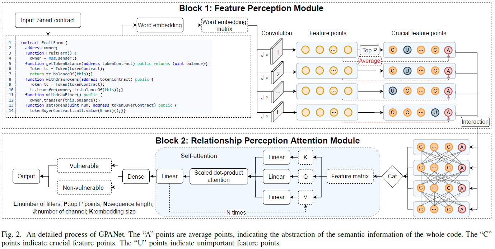

# GPANet
This repo is a paper of python implementation : Improving Smart Contract Vulnerability Detection via Plug-and-Play Feature Perception Module

# Framework

The overview of our proposed method GPANet is illustrated in the Figure, which consists of two components: Feature Perception Module (FPM) and Relationship Perception
Attention Module (RPAM).

# Required Packages
- python 3+
- transformers 4.26.1
- pandas 1.5.3
- scikit-learn1.2.2
- pytorch 1.13.1

# Datasets
## Datasets for ESC and VSC
Our proposed method is empirically evaluated on two benchmark datasets, namely Ethereum smart contract (ESC) and VNT Chain smart contract (VSC). Following the methodology of [Liu et al., 2021](https://github.com/Messi-Q/AMEVulDetector)  and [Liu et al. 2021](https://github.com/Messi-Q/GPSCVulDetector), we conduct experiments to assess reentrancy and timestamp dependence vulnerabilities on ESC, while evaluating infinite loop vulnerability on VSC.

Further instructions on the dataset can be found on [Smart-Contract-Dataset](https://github.com/Messi-Q/Smart-Contract-Dataset), which is constantly being updated to provide more details.

We have conducted a thorough examination of the contracts and labels, eliminating any instances of duplication in ESC as outlined in Section IV of the paper. 

The resulting dataset has been designated as ECS_R and can be accessed within the Data file.  

## Dataste for SmartBugs

We discuss our approach with some special methods (including [Wu et al. 2021](https://github.com/wuhongjun15/Peculiar)) in [SmartBugs](https://github.com/smartbugs/smartbugs-wild/tree/master/contracts) dataset in Section V.

# Running
To run program, please use this command: python Main.py.

Also all the hyper-parameters can be found in Main.py.

Examples:

`
python Main.py --project reentrancy 
`

## Statistical Analysis

We also provide a statistical analysis module with the goal of recording significant code snippets captured in FPM. To run this module, please use this command: python Statistical_analysis.py.

Examples:

`
python Statistical_analysis.py --resume model_path --fail_code_path ftxt_path --success_code_path stxt_apth --success_n_code_path sntxt_path
`

We provide a simple word cloud module to visualize them in WordCloud.py.

You can runing:

`
python gen_wordcloud.py --cloud_txt_path
`
